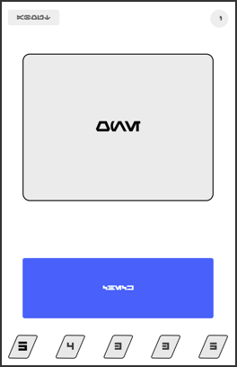
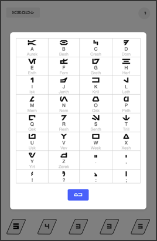
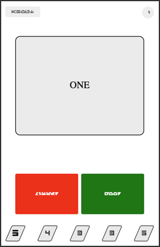

## SRS flashcard program for learning Aurebesh (the Star Wars font)

This project is a simple, free trainer for [Aurebesh](https://aurebesh.org/), the font that's used extensively at the [Galaxy's Edge](https://disneyparks.disney.go.com/star-wars-galaxys-edge/) areas of the Disney parks, in places like this:

This program uses a "spaced repetition system" to help you learn most efficiently.  Also, it's designed so that you can download it to your phone and use it offline.  A great way to pass the time while waiting in line!

## Play Now

You can use this app immediately by simply going here in your browser:

https://joestrout.github.io/aurebesh-trainer/

Once the page is loaded, no further network connection is needed.  You can even save the app to your phone/tablet home screen if you like.

## How To Use

The app shows you a word or letter (or "?" symbol) in Aurebesh in a big "card" in the top half of the screen.

When you need help remembering the Aurebesh letters, click the circular button in the top-right corner of the screen.  That brings up the reference card.

When you think you've figured out what the word is, tap the big blue button (the caption on that button means "Check").  This will reveal the word in plain English, and give you two buttons to choose from down below.

If you were able to read the word without help, then tap the big green "Good" button.  If you missed it or needed help, tap the red "Missed" button.

The cards are organized into five bins, shown at the bottom of the screen.  When you tap "Good", the card moves one bin to the right.  When you tap "Missed", it goes all the way back to the left.  Cards are presented in such a way that you see ones further to the left a lot more than the ones on the right.  The net effect is that you spend more time learning new stuff, and less time reviewing stuff you already know.

Aurebesh Trainer includes about 125 cards, all drawn from text actually found at Galaxy's Edge or in the movies.

## More Examples

Your effort with this app will be rewarded by the ability to read signs like these:

And important warnings, like this one on a water fountain:

You will even be equipped to find apparent mistakes, like this one above a port in line for _Rise of the Resistance_:

Watch out for that toxic flui!

## About the Author

Aurebesh Trainer was created by Joe Strout, in a fit of inspiration after visiting the _Galaxy's Edge_ park in Disneyland.  Joe is also the author of the [MiniScript](https://miniscript.org) language and [Mini Micro](https://miniscript.org/MiniMicro), a great free programming environment.  Ever wanted to learn to code?  Already know how to code but want a fun environment with a friendly community?  Give [MiniScript](https://miniscript.org) a try!
